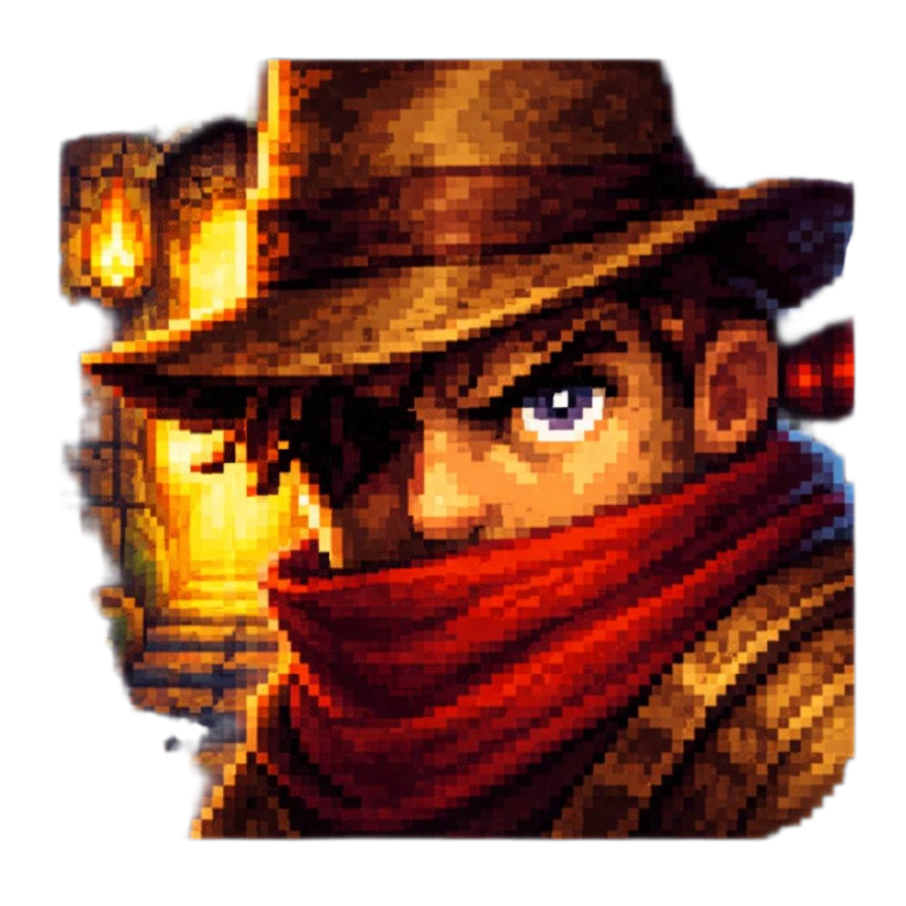

**Escape From the Dungeon** - 2D игра для ОС “Аврора”, шутер про побег из подземелья с этажами, врагами и финальным боссом.

---
**🎮 О проекте:**

   - Escape From The Dungeon - это двухмерная игра в жанре dungeon crawler, разработанная на движке Godot Engine в качестве учебной практики, предназначенная для работы в операционной системе ОС “Аврора”.
  
   - Главный герой - авантюрист, который отправился в подземелье за священным кладом, но случилась беда и он оказался в плену у пещерных существ. 

   - Теперь сокровища уже не важны: его задача - прорваться через несколько этажей опасного подземелья, выбраться на поверхность и вернуться к семье.

---
**✨ Ключевые особенности:**

   - Этажи подземелья: исследуйте этажа подземелья, каждый из которых состоит из набора комнат с врагами, ловушками и вратами, ведущими на следующий этаж.
    
   - При смерти герой возрождается на последней точки сохранения, сохраняя прогресс прохождения предыдущих этажей.
    
   - Динамичная стрельба: двустиковое управление - отдельное управление движением и направлением огня, необходимость постоянно двигаться и уклоняться от пуль.
    
   - Продуманная боевая система: несколько типов врагов и финальный босс с набором атакующих паттернов (веерные и круговые залпы).
    
   - Прогрессия сложности: система жизней на основе сердечек, сложность возрастает от этажа к этажу.
    
   - Оптимизация под ОС “Аврора”: игра разрабатывается и тестируется на устройствах, поддерживающих ОС “Аврора”.
    
---
**🛠 Технологический стек:**

  - Движок: Godot Engine 4.4
  
  - Основной язык программирования: GDScript  
  
  -  ИИ / производительные части (опционально): C++ через GDExtension  
    
  - Графика: 2D пиксельная 
    
  - Аудио: WAV/OGG 
    
  - Целевая платформа: ОС “Аврора”. 
    
  - Система контроля версий: GitHub  
    
---

**📦 Установка и запуск:**

Требования:

  - Операционная система: ОС “Аврора” 
    
  - Свободное место на диске: 512 MB  
  
Запуск из исходного кода (для разработчиков/тестировщиков):

  - Убедитесь, что на системе (ПК/устройство разработчика) установлен Godot Engine 4.4.  
  
  - Убедитесь, что в системе установлен Godot Engine.
  
  - Склонируйте репозиторий, с помощью команды, приведенной ниже, или скачайте архив с исходным кодом: git clone https://github.com/top-it-090304/Altair.git
  
  - Откройте Godot Engine и нажмите "Импортировать".

  - Укажите путь к папке проекта и выберите файл EscapeFromTheDangeon.godot.
  
  - Нажмите кнопку "Запустить проект" в редакторе.
  
---

**🕹 Игровой процесс:**

   - Старт: игрок начинает на первом этаже подземелья, у стартовой точки/чекпоинта.
  
   - Исследование: передвигайтесь по комнатам этажа, ищите врагов, ловушки и врата на следующий этаж.
  
   - Бой: используйте двустиковое управление. Враги стреляют по вам пулями, от которых нужно уклоняться.
  
   - Прогрессия: у героя 5 сердец. Обычные враги снимают половину сердца, усиленные и босс - целое. При потере всех сердец герой погибает и возрождается в начале текущего этажа.
  
   - Новый этаж: после зачистки ключевых комнат и нахождения ворот герой переходит на следующий этаж. На финальном этаже его ждёт босс после победы показывается концовка с побегом из подземелья.
---  
**👾 Управление:**

   - Левый джойстик: перемещение персонажа.
    
   - Правый джойстик: выбор направления стрельбы.
    
   - Кнопка выстрела: атака в выбранном направлении.
---
**🧑🏻‍💻 Для тестов на ПК:**

   - WASD: движение.
    
   - Мышь: направление стрельбы.
    
   - ЛКМ: выстрел.
    
   - ESC: пауза.
