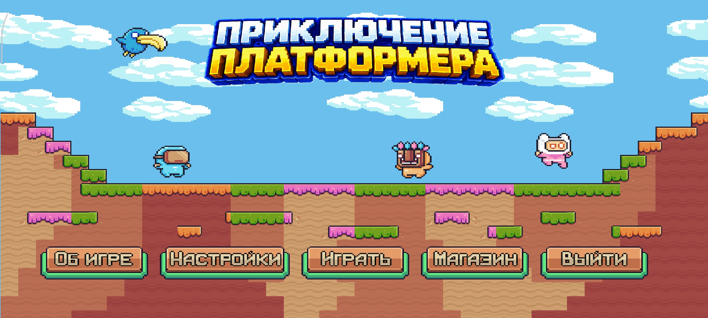
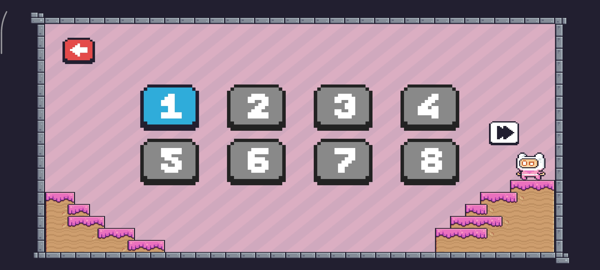
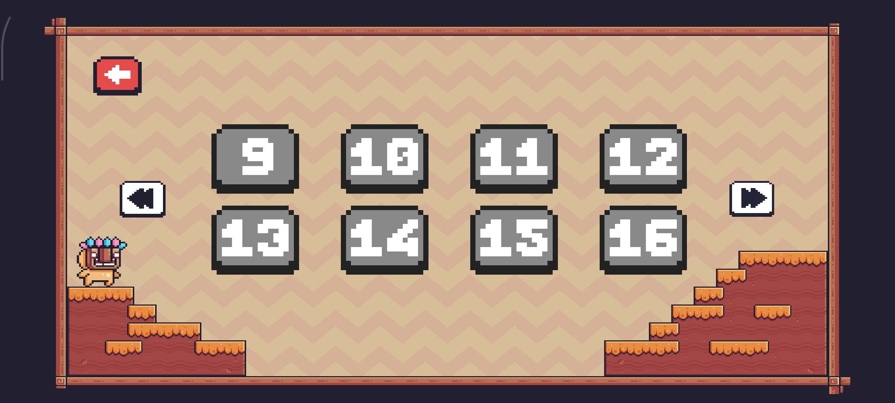
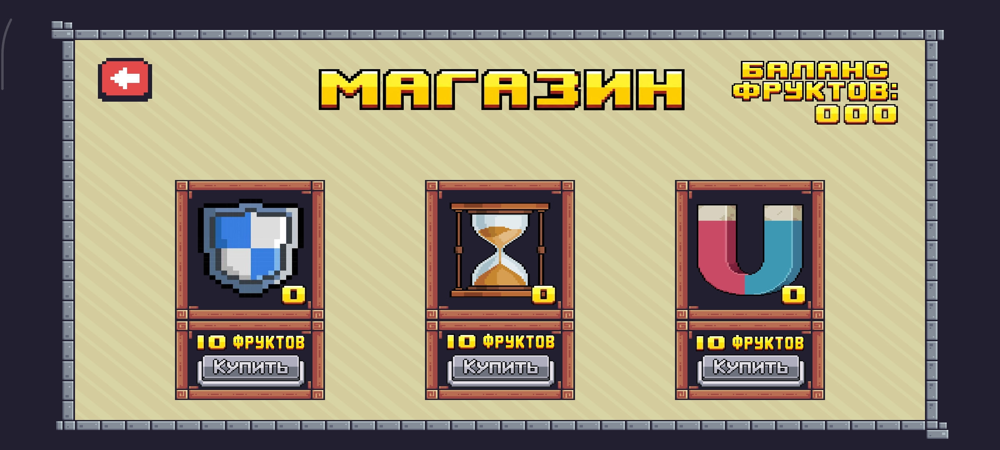
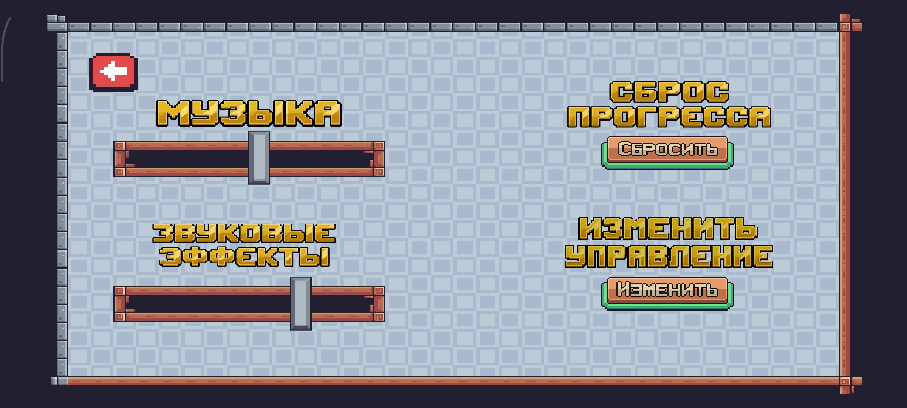
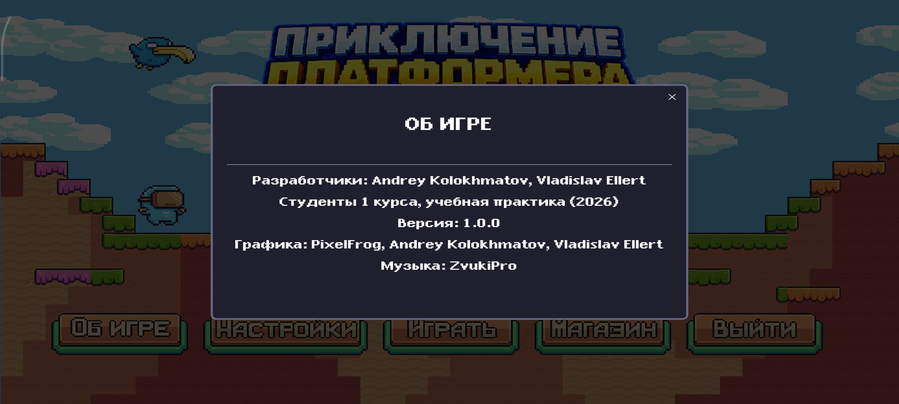

# 🎮 Приключение Платформера

**Динамичный 2D-платформер для ОС «Аврора»**

---

## 🎬 Геймплей

<!-- Сюда вставить GIF с геймплеем -->

---

## 📖 О проекте

**Приключение Платформера** — это двухмерный платформер, разработанный на **Godot Engine** для операционной системы **«Аврора»**.

Игроку предстоит пройти серию из **24 уровней**, преодолевая препятствия, избегая ловушек и демонстрируя точность управления. Главная цель — дойти до конца уровня. Проект выполнен в ярком 2D-стиле.

---

## ✨ Ключевые особенности

- 🗺️ 24 проработанных уровня
- 📈 Постепенное увеличение сложности
- 🆕 Новые механики по мере прохождения
- 🌍 Разные биомы

---

## 🧗‍♂️ Точная платформенная механика

- Базовый прыжок
- Возможный двойной прыжок
- Движущиеся платформы
- Исчезающие платформы
- Ловушки
- Чекпоинты

---

## 🎯 Главная цель

- Дойти до конца уровня
- Собрать все фрукты

---

## 📱 Оптимизация под ОС «Аврора»

- Сенсорное управление
- Экранные кнопки
- Оптимизация под мобильные устройства

---

## 🖼️ Скриншоты

### Главное меню

### Загрузочный экран

### Выбор уровней — Pink Man

### Выбор уровней — Mask Dude

### Выбор уровней — Virtual Guy

### Магазин

### Настройки

### Смена управления

### Экран об игре

---

## 🛠 Технологический стек

| Компонент | Используется |
|-----------|--------------|
| Движок    | Godot Engine 4.4 |
| Язык      | GDScript |
| Графика   | 2D |
| Аудио     | WAV / OGG |
| Платформа | ОС «Аврора» |
| Контроль версий | GitHub |

---

## 💻 Управление для тестов на ПК

| Клавиша | Действие |
|---------|----------|
| **WASD** | Движение |
| **Пробел** | Прыжок |
| **Двойной пробел** | Двойной прыжок |
| **ESC** | Пауза |
