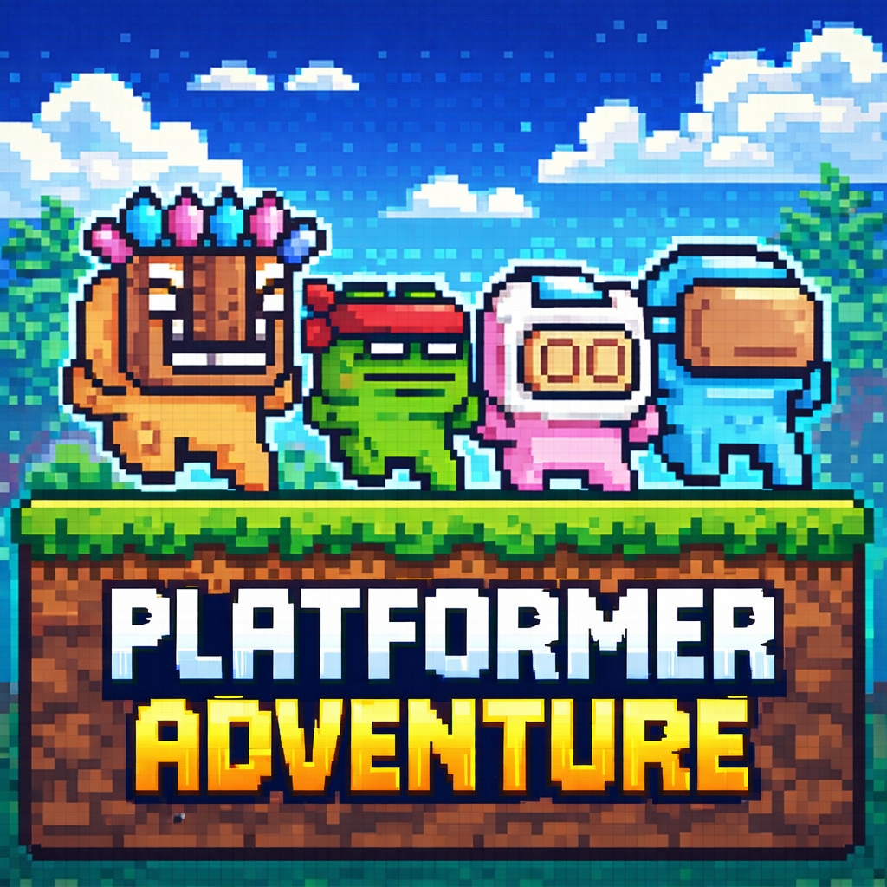

**🎮Platformer Adventure** — 2D платформер для ОС «Аврора»

---
**📖 О проекте**

**Platformer Adventure** — это двухмерный платформер, разработанный на Godot Engine для операционной системы «Аврора».
Игроку предстоит пройти серию из 32 уровней, преодолевая препятствия, избегая ловушек и демонстрируя точность управления. Главная цель — дойти до конца уровня.
Проект выполнен в ярком 2D стиле.

---
**✨ Ключевые особенности**
 - Много уровней
 - Постепенное увеличение сложности
 - Новые механики по мере прохождения
 - Разные биомы
 - Большое количество мобов
---
**🧗‍♂️ Точная платформенная механика**
 - Базовый прыжок
 - Двойной прыжок
 - Исчезающие платформы 
 - Ловушки
 - Чекпоинты
---
**🎯 Главная цель**
 - Дойти до конца уровня.
 - Собрать все фрукты
---
**📱 Оптимизация под ОС «Аврора»**
 - Сенсорное управление
 - Экранные кнопки
 - Оптимизация под мобильные устройства
---
**🛠 Технологический стек**
 - Движок: Godot Engine 4.4
 - Язык: GDScript
 - Графика: 2D 
 - Аудио: WAV / OGG
 - Платформа: ОС «Аврора»
 - Контроль версий: GitHub
---
**💻 Для тестов на ПК**
 - WASD — движение
 - Пробел — прыжок
 - Двойной пробел — двойной прыжок
 - ESC — пауза
